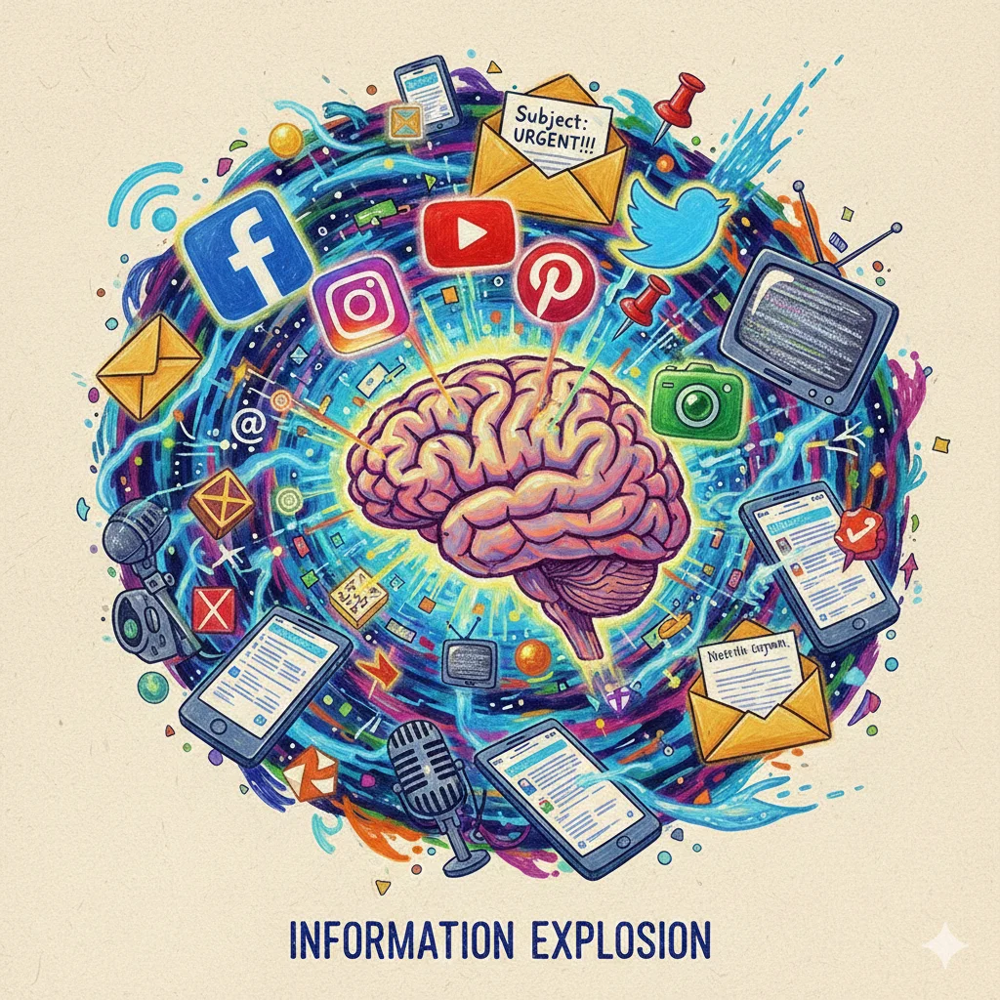

There was a time when silence was normal.

You could sit somewhere and your mind would simply… rest. Thoughts came and went on their own. Curiosity existed, but it wasn’t constantly triggered. You learned things, but learning had edges — it started and it stopped.

Today, that boundary is gone.

From the moment we wake up, information rushes in. Notifications before we even get out of bed. Messages, headlines, videos, opinions, updates. Even when we are not actively looking for information, it finds us anyway.

This is what living with **constant information noise** feels like.

And most of us don’t even realize how loud it has become.

## The Noise Is Subtle, Not Obvious

Information noise isn’t just useless content. That’s what makes it dangerous.

A lot of what we consume is genuinely interesting. Educational videos. Thoughtful posts. Long threads. Tutorials. Commentary. Ideas that *feel* valuable. We tell ourselves we are learning, staying informed, keeping up.

And sometimes, we really are.

But the problem is not whether the information is good or bad. The problem is **volume without pause**. Intake without digestion. Learning without reflection.

Our minds were never meant to operate like open tabs that never close.

## When the Mind Never Gets to Finish a Thought

Have you noticed this?

You watch a video about one topic. Then another related one appears. Then another. Your brain connects the dots, but before it finishes processing, something new interrupts. A new idea. A new perspective. A new angle.

The previous thought never fully settles.

Later, when you try to rest, your mind replays fragments. Sentences you heard. Concepts you half-understood. Questions you didn’t get time to answer. Even during sleep, the brain seems busy organizing unfinished information.

It’s not anxiety. It’s not laziness.

It’s **cognitive overload**.

You are not failing to focus — your mind is overloaded with open loops.

## The Internet Rewards Noise, Not Clarity

Modern platforms are not designed for understanding. They are designed for **attention**.

Algorithms don’t ask whether something makes sense to you. They ask whether it keeps you engaged. Whether you stay longer. Whether you click again. Whether you react.

Depth doesn’t perform as well as speed. Silence doesn’t perform at all.

So the internet pushes more. Faster. Louder. Constantly refreshing the stream so you never reach the bottom — because reaching the bottom would mean stopping.

And stopping is bad for business.

## Why We Feel Guilty for Wanting Quiet

What’s strange is how uncomfortable quiet has become.

When we don’t consume something, we feel behind. Out of the loop. Unproductive. Like we are wasting time. Even rest feels like something we must justify.

This guilt is learned.

Somewhere along the way, being constantly informed became a moral good. Being offline started to feel irresponsible. But no one told us how to process what we consume — only how to consume more.

So we carry noise everywhere. In our pockets. On our desks. Into our beds.

## How Noise Changes the Way We Think

Living in constant information noise doesn’t just tire us — it reshapes us.

- We skim instead of reading deeply  
- We recognize ideas without understanding them  
- We repeat phrases we’ve heard instead of forming our own thoughts  
- We react quickly but reflect less  

Over time, thinking becomes shallow not because we are incapable, but because we are never given space.

The mind becomes a hallway of passing thoughts instead of a room where ideas can sit.

## Learning Without Space Is Not Wisdom

There is a difference between **exposure** and **understanding**.

You can watch ten videos about a topic and still not truly understand it. Understanding requires time. Repetition. Silence. Letting the idea collide with your own experiences.

But the internet rarely gives you that space. It moves on before you do.

So you carry unfinished learning with you — and it accumulates.

That weight is what many people feel as mental exhaustion.

## Choosing Less Is an Act of Care

Here’s the part that often gets misunderstood:

- Wanting less information does not mean you are anti-knowledge  
- Choosing quiet does not mean you lack ambition  
- Slowing down does not mean you are falling behind  

It means you are respecting the limits of a human mind.

Some of the clearest thinking happens *after* the input stops. Some of the best insights come not from consuming something new, but from sitting with what you already know.

## Living Differently With Information

You don’t need to disconnect from the world to escape information noise. You just need to change your relationship with it.

Small shifts help:

- Fewer platforms, not more  
- Reading one thing fully instead of five things halfway  
- Creating space between learning sessions  
- Allowing boredom — it’s not emptiness, it’s recovery  

Silence is not wasted time. It is processing time.

## A Quiet Truth

The internet is loud because it benefits from being loud.

Your mind does not.

Living with constant information noise doesn’t mean something is wrong with you. It means you are human in a system that forgot humans need pauses.

Sometimes the most meaningful thing you can do is stop scrolling, stop watching, stop listening — and let your thoughts catch up with you.

Clarity doesn’t come from more input.

It comes from **space**.
